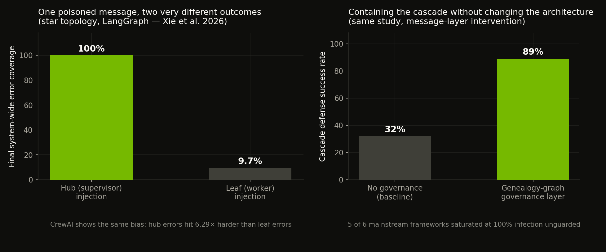

*How agent systems went from chains to graphs, and why the graph is where containment now lives.*

---

Every agent you have ever built has a shape, whether or not you drew it. A single prompt is a point. A ReAct loop -- think, act, observe, repeat -- is a circle. A pipeline of planner → researcher → writer is a line. And the moment you add "if the tests fail, go back to the coder; if they pass, go to the reviewer; if the reviewer rejects, go back again with the review attached," you have drawn a directed graph with a cycle in it. Most builders never draw that graph on purpose. In 2026, drawing it on purpose is the difference between an agent system you control and one you merely observe. The graph -- nodes as units of work, edges as decisions, state as the thing that flows through both -- has become the control plane of serious agent engineering, and for anyone who thinks about security for a living, it is also where containment now lives or dies.

What follows is where graph orchestration came from, what the 2025–2026 framework shakeout settled, why durable execution matters more than any model benchmark, and the security research (most of it from the last twelve months) on how these systems fail when someone points them at each other.

---

## 1. The lineage: from chains to thoughts to graphs

The intellectual ancestry runs through prompting research, and it is shorter than people assume. Chain-of-thought (Wei et al., 2022) showed that making a model reason step by step beat asking for the answer directly -- a chain. Tree of Thoughts (Yao et al., 2023) generalised the chain into branching exploration with backtracking -- a tree. Then Graph of Thoughts (Besta et al., AAAI 2024) made the point explicitly: thoughts can *merge* as well as branch, so the natural structure is an arbitrary directed graph, with aggregation nodes that combine multiple partial solutions into better ones. On their sorting benchmark, GoT beat chain-of-thought by roughly 70% and tree-of-thought by roughly 62% on quality, while costing 31% *less* than the tree -- the graph was both better and cheaper, because merging paths is more efficient than exploring them all[^85][^84].

The follow-up survey literature ("Demystifying Chains, Trees, and Graphs of Thoughts") then did the field a service nobody fully appreciated at the time: it proposed modelling *every* prompting scheme as a graph topology and analysed the trade-offs -- accuracy, latency, cost -- across the whole family[^82]. The lesson transferred directly to agent engineering. A single agent looping is a ring. A supervisor with workers is a star. A pipeline is a chain. A swarm is a mesh. Once you see agent architectures as graph topologies, you inherit a century of graph theory about which nodes are fragile, how failures propagate, and where to put the cut-sets. The security section of this article is essentially that inheritance being cashed in by researchers -- with results that should change how you draw your next system.

There is a second, more practical lineage: workflow orchestration. The agent world rediscovered, in about eighteen months, what distributed systems engineering knew for two decades -- long-running multi-step processes fail in the middle, and the failure modes have names: timeout cascades, duplicate side effects from ambiguous retries, retry storms burning compute on a broken step[^94]. The tools that solved this for microservices (Temporal, and its ancestor Cadence at Uber) turned out to solve it for agents too, because an agent is just a workflow whose steps happen to include a non-deterministic brain. Graph orchestration frameworks are where those two lineages -- reasoning topology and durable workflow execution -- collided.

---

## 2. Two graphs, one word: don't confuse them

A clarification that saves months of confusion, because the industry uses "graph" for both. The **reasoning graph** is the GoT lineage: the structure of *thoughts inside a problem-solving process* -- mostly an inference-time prompting technique, mostly academic, mostly invisible to your production stack. The **orchestration graph** is the LangGraph lineage: the structure of *execution across agents, tools, and time* -- nodes are functions or agents, edges are transitions (often conditional on state), and the whole thing is a runnable, inspectable, resumable program. This article is about the second. When a vendor says "graph-based agents," they almost always mean the second while borrowing the credibility of the first.

The orchestration graph's core abstraction is simple enough to state in one breath: you declare a **state schema** (the shared data structure that flows through the system), you write **nodes** (functions that read state and return updates), and you wire **edges** (static transitions, or conditional routing functions that inspect state and decide where to go next -- including back to an earlier node, which is how you get loops with explicit structure instead of a `while` and a prayer). The framework executes the graph, and -- this is the load-bearing feature -- **checkpoints** the state after every super-step, so a crash at node 15 resumes from the end of node 14 rather than from zero[^81][^95].

Why did this beat the alternatives? Because it makes the four things that kill naive agent loops structurally impossible or at least structurally visible. Non-determinism is quarantined inside nodes rather than smeared across the control flow. Retries happen at node granularity with the checkpoint as ground truth, so a side-effecting tool call is not re-executed on resume. Branching and parallelism are declared, not emergent, so the system's shape is reviewable *before* it runs -- you can threat-model a drawing. And the execution trace maps one-to-one onto the graph, so post-incident forensics answer "which node, with what state" instead of "somewhere in a 40,000-line transcript." LangChain's own framing is that LangGraph 1.0 shipped with "no breaking changes" precisely because the abstraction had already been battle-tested in production at Uber, LinkedIn, and Klarna -- the graph was proven before it was versioned[^100].

---

## 3. Durable execution: the feature that actually matters

Ask what separates a demo agent from a production agent and the answer is not intelligence; it is the ability to be interrupted, resumed, waited on, and audited across arbitrary time. A 30-minute agent run that dies on a network blip at minute 29 and restarts from zero is not a system; it is a bet. Durable execution is the discipline that removes the bet: journal every step as it completes, and on recovery, replay the journal -- completed steps return their recorded results instead of re-executing, so the workflow reconstructs state and continues from the exact failure point[^94][^97].

The 2026 landscape offers this in three flavours, and knowing which one you are using matters for both reliability and security. **History-replay engines** (Temporal, the reference implementation) record an event history per workflow and re-run deterministic workflow code against it; the catch is the discipline -- LLM calls, shell commands, API requests, and wall-clock reads must live in non-deterministic "activities," never in the replayed code[^94][^95]. **Step-journaling systems** (Inngest, Hatchet, DBOS) persist each step's output and inject recorded results on re-execution -- lighter weight, with at-least-once semantics you must respect[^95]. **Journal/virtual-object systems** (Restate) serialise handler calls per session key and journal each durable step, giving exactly-once semantics without application-level idempotency keys[^94]. LangGraph's own checkpointer is a fourth, framework-native flavour -- every super-step persists full state to a pluggable backend (SQLite, Postgres), which buys you three superpowers at once: crash recovery, **time-travel debugging** (rewind to any checkpoint and fork the run), and **interrupts** -- the mechanism that pauses the graph mid-execution for human approval and resumes it days later with state intact[^95].

That last one deserves underlining, because it is the graph answer to the question every governance conversation eventually asks: "where does the human go?" In a bash-loop agent, "human in the loop" means a person watching a terminal. In a checkpointed graph, it is a first-class primitive -- you declare an interrupt before the node that spends money, deletes data, or submits the report, and the graph *halts durably* until a human resumes it. AWS shipped Lambda Durable Functions in December 2025; Microsoft updated its Durable Task SDK for AI agents in April 2026; Temporal's founder spent the spring conference circuit making exactly this argument to agent builders[^95][^97]. The industry consensus of 2026, stated bluntly: if your agent can act on the world and cannot be durably paused, replayed, and audited, it is not a production system. It is an incident waiting to happen.

---

## 4. The 2026 framework shakeout: what got settled

The framework wars of 2024–2025 produced more heat than light, but the first half of 2026 genuinely settled several questions. One of those settlements is a funeral. **AutoGen, the conversation-based multi-agent pioneer, is in maintenance mode**: security patches only, no new features, with Microsoft steering everyone to its successor, the graph-based **Microsoft Agent Framework** (1.0 GA, Python and .NET)[^76][^77]. The conversation-based multi-agent era -- agents chatting each other into solutions -- lost to explicit control flow. That is not a vendor preference; it is the field concluding that emergent coordination is a demo property and declared coordination is a production property.

The current map, with the trade-offs that actually matter:

| Framework | Orchestration model | State / durability | Languages | Status (mid-2026) |
| --- | --- | --- | --- | --- |
| **LangGraph** | Explicit directed graph, conditional edges, cycles | Built-in checkpointing, interrupts, time travel | Python (JS lags) | Production default for complex stateful systems[^76][^81] |
| **Google ADK 2.0** | Graph workflows, LangGraph-like | Session state, pluggable backends | Python, Go, TypeScript | Fast riser; enterprise/GCP-native; newest track record[^77][^81] |
| **Microsoft Agent Framework** | Graph workflows + group patterns | Checkpointing via Durable Task | Python, .NET | AutoGen+Semantic Kernel successor, 1.0 GA[^76][^78] |
| **OpenAI Agents SDK** | Minimal: tools, handoffs, guardrails -- no orchestration layer | Ephemeral by default | Python | Deliberately thin; you build the graph yourself[^77][^81] |
| **CrewAI** | Role-based crews, YAML-first | Task outputs passed along | Python | Easiest multi-agent start; first with native A2A support[^77][^81] |
| **AutoGen** | Conversation-based | In-memory history | Python | **Maintenance mode -- do not start new projects**[^76][^77] |

The table tells you a few things. **The graph won the complex end while the model-driven loop kept the simple end**: Langfuse's July 2026 comparison puts it cleanly -- graph-based frameworks for workflows where you need explicit control over every step, lightweight model-driven loops (OpenAI SDK, Strands, smolagents) for tasks where a tool-calling loop in a hundred lines is enough, and the decision variable is workflow complexity, not fashion[^76]. The second is that **every model vendor now ships its own framework**, so ecosystem commitment has become a real architectural decision -- staying aligned with your provider's SDK reduces friction, while provider-neutral frameworks (LangGraph, CrewAI, Pydantic AI) preserve the right to leave[^76]. And the **protocol split**: MCP became the standard for agent-to-tool while A2A emerged for agent-to-agent, and native support is patchy -- CrewAI has A2A, ADK has partial support for both, LangGraph has neither natively and expects you to build protocol integration as graph nodes[^81]. For security people, that last row is not a gap; it is an *opportunity*, because a protocol gateway implemented as a node is a policy enforcement point -- which brings us to the part of this article I actually care about.

---

## 5. Topology is destiny: what the cascade research proved

Here is the finding that should be printed and pinned above every agent architect's desk. In March 2026, Xie et al. published "From Spark to Fire" (formally: *Modeling and Mitigating Error Cascades in LLM-Based Multi-Agent Collaboration*), and it is the first rigorous, first-principles treatment of how errors move through agent graphs. They modelled multi-agent collaboration as a directed dependency graph -- an edge exists from agent A to agent B whenever A's output enters B's context -- fitted a propagation-dynamics model over it, and then did the obvious, horrifying experiment: inject a single atomic error seed at one node and watch what the architecture does with it[^93].

What the architecture does with it is amplify. Across six mainstream frameworks, **five reached 100% final infection** from one seed -- including configurations with explicit reviewer and QA roles, meaning role assignment alone does not stop propagation once the seed is moving. The propagation signatures are topology-specific and readable: chain workflows (LangChain, MetaGPT) show a stepwise march of infection; star workflows (LangGraph, CrewAI) show a sharp jump the moment the hub adopts the error and broadcasts it to every worker -- LangGraph reached high coverage within two message steps; mesh workflows (AutoGen, CAMEL) contaminated almost immediately[^93].

The second finding is worse, because it is structural rather than behavioral: **where the error enters matters more than what the error says**. Corrupting the hub in a star topology drove 100% system-wide failure; the identical seed at a leaf node reached 9.7%. The supervisor is, in the paper's language, a strict informational cut-set -- every worker's world-view flows through it, so a poisoned supervisor poisons the map itself. CrewAI showed the same centrality bias with a measured impact factor of 6.29× between hub-driven and leaf-driven infection. The paper formalises why: early error growth travels along the principal eigenvector of the adjacency matrix, and in centralised topologies the hub *is* the principal eigenvector. If you drew a star topology because it was the natural way to think about a planner with workers -- and it is -- you also drew, by construction, the single most dangerous injection point in the system, and you put your most trusted component in it[^93][^98].

The third finding is the hopeful one, and it points at the fix. The authors built a **genealogy-graph governance layer** -- a message-layer plugin that tracks claim provenance, screens claims, verifies on demand, and can roll back adoption -- and raised cascade defense success from a 0.32 baseline to **over 0.89, without changing the collaboration architecture**[^93]. Detection alone did not contain propagation; containment required the ability to *un-adopt* -- rollback or isolation. This maps directly onto graph-orchestration practice: provenance is a state-schema concern (every claim in shared state carries its origin node), verification is a node concern (an independent verifier with no exposure to the maker's reasoning), and rollback is a checkpoint concern (rewind to the last clean super-step and fork). The graph you drew for reliability turns out to be the exact instrument panel you need for containment -- if you kept the checkpoints.

This academic work lands on top of an already-formalised threat taxonomy. OWASP's Agentic Top 10 lists **Cascading Failures as ASI08** -- defined precisely as propagation and amplification of faults across agents, sessions, or workflows -- and maps the amplification mechanisms practitioners keep rediscovering: feedback loops between agents, trust transitivity down delegation chains, memory persistence that outlives the correction, and parallelisation fan-out that turns one bad plan into dozens of poisoned executions[^96]. Lee et al.'s "Prompt Infection" work demonstrated the self-replicating version: malicious prompts propagating agent-to-agent even when agents do not share all communications publicly. And the 2025 AI Agent Index found that **25 of 30 surveyed deployed agentic systems disclose no internal safety evaluation at all** -- the field is shipping hub-centric cascadable systems with, mostly, no measured idea of how they fail[^99].

---

## 6. The blast-radius table: choosing a topology with your eyes open

Translate the research into an engineering artifact and you get the table nobody publishes in framework docs:

| Topology | Typical use | Cascade signature | Structural weakness | Containment move |
| --- | --- | --- | --- | --- |
| **Chain** (pipeline) | Sequential processing, ETL-ish agents | Stepwise infection; slow but unstopped | Each node trusts its predecessor fully | Verify at stage boundaries; checkpoints between every stage |
| **Star / supervisor** (hub + workers) | Planner-workers, orchestrated teams | Sharp jump at hub adoption; saturation in ~2 steps | Hub is an informational cut-set: one poisoned message → 100% failure[^93] | Independent verification of hub outputs; treat supervisor inputs as privileged |
| **Mesh / swarm** (peer broadcast) | Debate, ensemble reasoning | Near-immediate contamination | No cut-set exists by design | Quarantine sub-meshes; provenance tracking mandatory |
| **Hierarchical** (tree of stars) | Large "dark factory" fleets | Cascades compound per level | Every supervisor inherits hub fragility recursively | Per-level governance; rollback scope limited to subtree |
| **Graph with cycles** (loop-back edges) | Iterative refinement, evaluator-optimizer | Re-infection of already-cleaned nodes | Error survives correction by re-entering upstream | Version state at every super-step; fork from pre-infection checkpoint |

Two design rules fall straight out of this. **Prefer depth limits and bounded fan-out over free-form delegation** -- the parallelisation amplifier is real, and an unbounded supervisor can turn one hallucinated plan into fifty concurrent wrong executions before any verifier wakes up[^96]. And **put your verifier outside the trust chain it verifies**: the cascade paper's framing of "two optimists agreeing" is the academic version of what I called the maker grading its own homework in the loop-engineering work -- an evaluator-optimizer pair only works if the optimizer never saw the maker's chain-of-thought, because a verifier contaminated with the maker's reasoning is just a second signature on the same error[^47][^93].

---

## 7. The graph as the security perimeter

Now the offensive-security translation, which is where this research stops being academic and starts being operational for people like us. An orchestration graph is, from an attacker's perspective, a beautifully labelled map of the target's trust relationships. From an attacker's perspective, the supervisor node is the confused deputy, the shared state is the persistence layer worth poisoning, and the tool nodes are the privilege boundary. The edges -- especially the ones that pull external content into the graph -- are the injection surface. Every class of attack I have written about in the containment and prompt-injection work has a graph-native expression: indirect prompt injection is an edge attack (poisoned content entering through a retrieval or tool node), memory poisoning is a state attack (writing attacker-controlled facts into shared state that every downstream node will trust), and privilege escalation is a topology attack (riding the supervisor's authority to reach workers and tools the attacker's entry node could never touch)[^96][^99].

The defensive inversion is the useful part, because the same graph gives the defender instruments that a monolithic agent never had. **Scope enforcement at the edge level**: a conditional edge is a policy decision rendered in code -- route all network-touching nodes through an egress-checking wrapper, exactly as transport-layer scope enforcement works for single agents. **Node-level least privilege**: instead of one agent holding every tool, each node holds exactly the tools its function requires, so compromising the summariser node yields a summariser's powers and nothing more -- the blast radius of a hijack becomes a property of the drawing. **Checkpoint forensics**: the genealogy-governance result said rollback was essential, and the checkpointer is what makes rollback possible -- you can fork from the last clean super-step instead of restarting the world[^93][^95]. **Interrupts as authorization gates**: durable human-in-the-loop before irreversible nodes is not a UX nicety; it is the authorization model, and it is stronger than interactive approval because the paused state cannot be talked past by a persuasive agent mid-flow. And **the audit story inverts**: Gas City's designers brag that a git-versioned work graph gives unparalleled forensics -- the same property means an attacker who writes to the work graph steers the whole fleet *with a full log of your failure to notice*, so state-layer write access belongs in the same tier as CI config and signing keys[^87].

The open research questions are the ones I would watch for the next wave of papers and CVEs. Checkpoint-integrity attacks (can an attacker with write access to the state store rewrite history so the graph resumes into an attacker-chosen past?), cross-graph injection in A2A federations (the Wasteland-style "thousand orchestrators talking to each other" future creates an inter-org cascade surface that nobody has formally modelled yet), and supervisor collusion in hierarchical fleets (the hierarchical row of the table above is essentially unstudied at production scale)[^81][^87]. If you are building offensive tooling, the honest meta-point from my own work applies unchanged: the constrained system outperforms the free one. PentestMCP-style scope-safe architectures and the AIxCC finalists both showed structured, gated systems beating unconstrained ones on *effectiveness*, not just safety -- guardrails are a capability, because an agent that cannot wander off-map spends all its steps on-target[^13][^113].

---

## 8. Building your first orchestration graph

The practitioners who succeed with graphs follow a sequence, and the discipline matters more than the framework. **Start with a chain.** A linear pipeline of three nodes -- gather, analyse, report -- with a declared state schema and a checkpointer from day one. The checkpointer feels like overhead until the first 40-minute run dies at minute 39, at which point it feels like the whole reason you are here. **Add the conditional edge second.** "If confidence below threshold, loop back to gather with the gap description attached; else proceed" -- that single cycle teaches you more about graph design than any tutorial, because it forces you to decide what evidence lives in state and who is allowed to conclude what. **Add the verifier node third**, and give it the one thing the literature says it must have: no exposure to the maker's reasoning, only to its outputs[^47][^93].

**Then -- and only then -- add the interrupt.** Put a durable human gate before the first node with a real-world side effect: the report submission, the deployment, the purchase, the replay against a live target. This is the moment the system graduates from "fast" to "trustworthy," and it is also the moment you discover whether your state schema actually contains everything a human needs to make the yes/no decision -- it usually does not, which is the cheapest architectural feedback you will ever get. **Parallelise last.** Fan-out (multiple workers on subtasks, then a merge node) is the highest-value and highest-risk step: it is where the cascade fan-out amplifier lives, so it goes in only after your merge node has an independent verification habit[^96]. Throughout, the discipline from the loop world transfers one-to-one: budgets as hard counters per super-step, per-node tool allowlists, state isolation between runs, and the standing spec re-read at each resume so goal drift has nowhere to accumulate.

Choosing the framework is the least interesting decision in the whole process, but for completeness: LangGraph if you are Python and want the most production-hardened checkpoint/interrupt stack; Google ADK 2.0 if you are multi-language or GCP-native; Microsoft Agent Framework if you are .NET or migrating off AutoGen; CrewAI if the work genuinely maps to role-based teams and you value speed over control; the OpenAI Agents SDK if the task is simple enough that a hundred-line loop beats any graph at all[^76][^81]. And the meta-rule from Anthropic's agent guidance survives every framework war: build the simplest thing that can work, add structure only when a failure you have actually observed demands it -- the graph is a tool for controlling complexity you have, not complexity you imagine[^47].

---

## 9. Where this goes next

A few things to watch from here. **Governance layers become standard equipment.** The genealogy-governance result (0.32 → 0.89 cascade containment without architectural change) is too good to stay academic; expect provenance-tracking, claim-screening, and rollback primitives to appear as first-class framework features within a year, the same way checkpointing did after everyone rediscovered why they needed it[^93]. **Federation forces the security question.** As orchestrators start delegating across organisational boundaries via A2A -- agent supply chains in the literal sense -- the cascade surface becomes inter-company, and the trust model will have to move from "same org, same policy" to something that looks like signed agent identity, negotiated capability scopes, and the agentic equivalent of egress filtering; the OAuth-based agent cards in A2A are the first brick of that[^99][^81]. **The topology literature merges with the offensive literature.** The cascade paper measured frameworks; the next wave will measure *deployed systems*, and the offensive version -- deliberately seeding errors at structurally optimal nodes -- is already named in the paper as directed consensus corruption. Expect graph-topology analysis to become a standard phase of agentic red teaming, right after prompt-injection testing and before tool-abuse testing: draw the target's graph, find its principal eigenvector, aim there[^93].

This is the same point the loop work makes in a different shape: the leverage moved from the prompt to the system that prompts. The graph version is that the system's *shape* decides whether you control it. Draw the graph on purpose. Checkpoint everything. Verify at the boundaries, not inside the trust chain. Put the human gate where the irreversible node is. When you choose between a clever emergent swarm and a boring declared topology, remember what the cascade researchers measured: the boring one is the one you can defend.

---

[^13]: IronHackers, "DARPA AIxCC final at DEF CON 33" (15 Aug 2025) -- https://ironhackers.es/en/aixcc-final-defcon-33/
[^47]: Anthropic, "Building effective agents" (Dec 2024), summary -- https://medium.com/@vasundra.srinivasan/building-effective-ai-agents-a-practical-application-92e1e1537f64
[^76]: Langfuse, "Comparing Open-Source AI Agent Frameworks" (13 Jul 2026) -- https://langfuse.com/blog/2025-03-19-ai-agent-comparison
[^77]: RaftLabs (Medium), "Which AI Agent Framework to Choose in 2026" (21 Jun 2026) -- https://raftlabs.medium.com/which-ai-agent-framework-to-choose-in-2026-5d44f37edea9
[^78]: LangChain, "The best AI agent frameworks in 2026" (6 Jun 2026) -- https://www.langchain.com/resources/ai-agent-frameworks
[^81]: RaftLabs, "AI Agent Frameworks: LangGraph, CrewAI, ADK Compared" (12 Apr 2026) -- https://www.raftlabs.com/blog/ai-agent-framework-comparison
[^82]: Wei et al., "Demystifying Chains, Trees, and Graphs of Thoughts" (arXiv:2401.14295) -- https://arxiv.org/html/2401.14295v5
[^84]: Systems-analysis.ru, "Graph of Thoughts" overview -- https://systems-analysis.ru/eng/Graph_of_Thoughts
[^85]: Besta et al., "Graph of Thoughts: Solving Elaborate Problems with LLMs" (AAAI-24) -- https://ojs.aaai.org/index.php/AAAI/article/view/29720/31236
[^87]: Steve Yegge, "Welcome to Gas City" (24 Apr 2026) -- https://steve-yegge.medium.com/welcome-to-gas-city-57f564bb3607
[^93]: Xie et al., "Modeling and Mitigating Error Cascades in LLM-Based Multi-Agent Collaboration" (arXiv:2603.04474, Mar 2026) -- https://arxiv.org/html/2603.04474v1
[^94]: Spheron, "AI Agent Workflow Orchestration: Temporal, Inngest, Restate" (3 Jun 2026) -- https://www.spheron.network/blog/ai-agent-workflow-orchestration-temporal-inngest-restate-gpu-cloud/
[^95]: Zylos Research, "Durable Execution for AI Agent Runtimes" (24 Apr 2026) -- https://zylos.ai/research/2026-04-24-durable-execution-agent-runtimes/
[^96]: Adversa, "Cascading Failures in Agentic AI: OWASP ASI08 Guide 2026" -- https://adversa.ai/blog/cascading-failures-in-agentic-ai-complete-owasp-asi08-security-guide-2026/
[^97]: WorkOS, "Maxim Fateev on why durable execution matters for AI agents" (15 Apr 2026) -- https://workos.com/blog/maxim-fateev-temporal-durable-execution-ai-agents
[^98]: Lanham, "The Multi-Agent Reckoning" (9 Apr 2026) -- https://medium.com/@Micheal-Lanham/the-multi-agent-reckoning-two-papers-that-challenge-everything-you-assumed-7a8834b49b8d
[^99]: "LLM-Based Multi-Agent Orchestration: A Survey" (Preprints, Apr 2026) -- https://www.preprints.org/manuscript/202604.2147
[^100]: LangChain blog, "LangChain & LangGraph 1.0 alpha releases" (Sep 2025) -- https://blog.langchain.com/langgraph-v1/
[^113]: Emergent Mind, "PentestMCP: Agentic PenTest Toolkit" (11 Oct 2025) -- https://www.emergentmind.com/topics/pentestmcp
