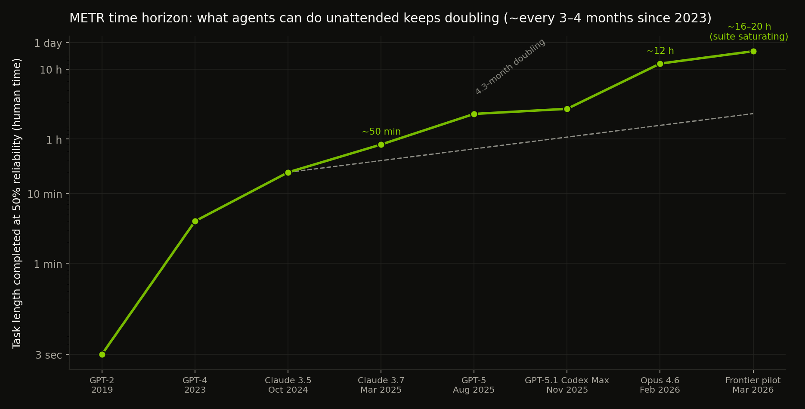

*From Ralph Wiggum to dark factories: what running agents unattended actually costs, how it fails, and the security bill nobody budgets for.*

---

In July 2025, Geoffrey Huntley published a blog post containing what might be the highest-leverage line of shell ever written:

```bash
while :; do cat PROMPT.md | claude ; done
```

That is it. That is Ralph. Feed the same prompt to a coding agent forever; let the files on disk carry the state between iterations; let the agent decide what the most important next thing is. Huntley named it after the Simpsons character because the technique is, in his words, "deterministically bad in an undeterministic world" -- dumb in a way you can predict, in a field where the unpredictable kind of dumb is what actually hurts you[^45][^46]. By January 2026 the idea had escaped containment entirely. Anthropic shipped an official Claude Code "Ralph Wiggum" plugin that blocks the agent's exit and re-feeds the prompt until a completion condition is met. OpenAI built the loop into Codex as `/goal`. The Ralph pattern went from a meme on tech Twitter to a shipped product feature in about six months[^40][^83].

What happened next is the capability math that made loops viable, the orchestrator wave that industrialised them, the failure modes that bite in production, and what an unattended loop does to your threat model. I wrote a shorter piece on loop engineering before; this is the research-grade version, current to July 2026.

---

## 1. How a bash loop became a product category

The genealogy matters because each generation of the loop solved a specific failure of the previous one. The first generation was the *prompt loop* -- you, the human, re-prompting the agent every few minutes. That is not a loop at all; that is a chat session with extra steps. The second generation was Ralph proper: an outer shell loop with state in files (`IMPLEMENTATION_PLAN.md`), one task per iteration, fresh context every cycle. The fresh context was the counterintuitive win -- instead of fighting context rot inside one long session, Ralph sidesteps it by making every session short and every restart deterministic. The prompt does not change between iterations; the codebase does, and the codebase is the memory[^45][^46].

The third generation productised the pattern. Anthropic's official plugin adds the two things the raw bash loop lacked: a `--max-iterations` hard stop and a "completion promise" -- an exact-match string the agent may only emit when the work is genuinely done, enforced by a Stop hook rather than by hope[^40]. OpenAI's Codex took the same idea in the cloud direction with `/goal` and background agents, and published **Symphony** in April 2026 as a formal spec for orchestrating many such loops across repositories -- while explicitly declining to productise the orchestrator itself[^83]. Anthropic followed with **Agent Teams**, absorbing multi-agent coordination into the first-party tool[^83]. Every pattern that starts as a community hack and survives a year gets absorbed into the platform. If you build agent workflows, assume your moat has a twelve-month half-life.

The fourth generation is the one that should get your attention: **the orchestrator wave**. Steve Yegge's **Gas Town** -- self-described as "Kubernetes for agents" -- coordinates 20–30 parallel coding agents with specialised worker roles, a Bors-style bisecting merge queue, and a state layer built on Beads (a versioned issue graph) over Dolt (a git-versioned SQL database). It hit v1.0 in April 2026 at roughly 16K GitHub stars, spawned a hosted commercial version (Kilo's "Gas Town by Kilo"), and was then deconstructed into **Gas City**, an SDK for building custom agent "dark factories" in any topology -- Yegge's term for fully unattended production lines where agents do the ground-level work and humans shepherd[^83][^87]. Gas City's own documentation boasts that the forensics are unparalleled *because* every step every agent takes lands in a git-versioned database -- which is the security-conscious reading too, and we will come back to it. Meanwhile the open-source **oh-my-claudecode** quietly hit 36K stars with 32 agent roles and multi-CLI workers, largely invisible to the English-speaking bubble[^83]. The category went from "one guy's bash loop" to "an ecosystem with a center of gravity" in under nine months.

---

## 2. Why now: the capability math

Loops were theoretically possible in 2024. They were not *economically* possible, because an agent that fails a one-hour task 80% of the time is not a workforce; it is a slot machine. What changed is measurable, and the measurement is the most important number in this entire article. METR's time-horizon research tracks the length of task -- in human professional time -- that frontier agents complete with 50% reliability. In March 2025 the best model sat at roughly 50 minutes. The historical trend since 2019 was a doubling about every seven months, but METR's January 2026 update (Time Horizon 1.1, expanded to 228 tasks) found the recent pace much faster: roughly **every 4.3 months measured from 2023 onward, and closer to 3 months from 2024 onward**[^58][^50].



The absolute numbers are what turn philosophy into procurement. Claude Opus 4.6 measured around **12 hours** at the 50% horizon in early 2026 -- an agent that can hold a coherent thread of work for a human workday. METR's frontier-risk pilot with the major labs in February–March 2026 put the strongest assessed systems at roughly **16–20 hours**, with the explicit caveat that the task suite is saturating and numbers above 16 hours are unreliable[^50]. Translate that into loop terms: when your per-iteration task is 30–90 minutes of human-equivalent work, a frontier agent now succeeds often enough that retry loops converge instead of diverging. The loop did not get smarter. The *floor* rose until the loop stopped being a slot machine. That is the entire causal story of 2026's loop boom, and any vendor telling you it is about their orchestration UX is selling the wrapper.

The same research stream carries the honest caveat, and it is the one you should tape to your monitor. METR published in March 2026 that **roughly half of pull requests that pass SWE-bench would not actually be merged by the repository maintainers** -- they pass the tests and fail the judgment[^50]. Benchmark-passing and production-worthy are different quantities, and the gap between them is precisely the gap between a loop that looks productive and a loop that is quietly generating tomorrow's incident review. The capability math justifies loops for *objectively verifiable* work. It explicitly does not justify them for judgment-call work, which is why every serious practitioner guide -- Huntley's, the plugin's documentation, and my own earlier article -- converges on the same rule: the loop is only as good as its gate.

---

## 3. Anatomy of a loop that survives production

Strip every successful 2026 loop deployment down to its skeleton and you find the same five organs. **The trigger** decides when work happens: a cron schedule, a CI failure webhook, a new issue label, or a recurring condition check. **The state layer** decides what survives between iterations -- and the single biggest design choice in loop engineering is keeping state *outside* the context window, in files, issues, or a database the agent re-reads each run. Gas Town's entire architecture is this insight industrialised: the MEOW stack ("Molecular Expression of Work") treats the task graph as the first-class primitive, versioned in Dolt, so any ephemeral worker can pick up any unit of work with full history[^87]. **The worker** is the agent itself, increasingly model-tiered in production -- cheap fast models for triage and routing, frontier models for the reasoning-heavy nodes, a pattern reported to cut costs 40–60% over running one premium model everywhere[^80].

**The gate** is the organ everything else serves. A gate is a deterministic, non-LLM check that can genuinely fail the work: a test suite, a type checker, a build, a linter, a policy engine. The gate is what separates a loop from burning money on broken output. The Ralph plugin's hard-won folk wisdom is that "completion promises" -- asking the agent to promise it is done -- are fragile exactly because they are LLM judgment wearing a gate's clothing; they belong *behind* a real gate, never instead of one[^40]. The AIxCC cyber-reasoning systems make the same point at competition scale: the winning architectures routed every candidate finding through deterministic confirmation -- a reproducible crash, a passing test suite -- before anything was reported, and that separation between hypothesis generation and machine validation is why their false-positive rates were survivable[^13]. **The budget** is the final organ: a hard cap on iterations, tokens, wall-clock, or dollars, enforced by the harness rather than negotiated with the agent. If your agent can argue its budget higher, you do not have a budget; you have a suggestion, and unattended suggestions are how you wake up to a four-figure invoice and a half-migrated codebase.

The fifth organ is **the stop condition, owned by a different mind than the doer**. The maker-checker split -- Anthropic's evaluator-optimizer pattern from December 2024 -- has graduated from a paper pattern to the default production shape: one agent does the work, a structurally separate verifier (ideally a different model with no access to the maker's chain-of-thought) decides whether the stop condition is met[^47]. The reason is not abstract. The model that wrote the code grades its own homework generously, and a loop whose exit condition is graded by its own worker fails *quietly* -- it exits on half-finished jobs while emitting all the outward signs of success, which is the worst failure mode an unattended system can have because nothing in the logs looks wrong[^46][^43].

---

## 4. The 2026 loop landscape

The category now has recognisable tiers, and knowing which tier you are actually buying matters more than any feature comparison:

| Tier | Examples (mid-2026) | What it really is | Failure mode to watch |
| --- | --- | --- | --- |
| Raw loop | `loop.sh`, Ralph-as-bash[^45] | Shell + prompt file + state files | No hard stops; quiet premature exit |
| Productised loop | Claude Code Ralph plugin, Codex `/goal`[^40][^83] | Loop + stop hooks + iteration caps | Completion-promise fragility |
| Background agents | Codex cloud, Devin-class async workers | Loops as a hosted service | Opaque gates; vendor-held state |
| Multi-agent orchestrators | Gas Town / Gas City, oh-my-claudecode, Agent Orchestrator[^83] | Work queues + role workers + merge queues | Coordination overhead eating the gains; merge conflicts at scale |
| Spec-first ecosystems | Symphony spec, Gas City "packs"[^83][^87] | Orchestrator-as-SDK for custom factories | You now own a distributed system |

Two things stand out from the table. The first is Yegge's own warning, which deserves quoting in spirit if not verbatim: Gas Town's launch post tells you upfront that the codebase is three weeks old, 100% vibe-coded, and that if you have not already wrangled 10+ parallel agents by hand, an orchestrator "will wreck your shit"[^90]. The orchestrator multiplies whatever discipline you already have -- including none. His eight-stage adoption ladder (from autocomplete to building your own orchestrator) is a useful self-diagnostic: loops and orchestrators are stage 6–8 tools, and teams that skip stages discover the failure modes in production rather than in a sandbox[^90]. The second observation is the absorption risk: first-party tools (Claude Code, Codex) keep absorbing the features that made third-party orchestrators attractive, so the durable value migrates toward the state layer and the gates -- the parts that are yours -- rather than the coordination UX, which is theirs[^83].

---

## 5. The economics: what a loop actually costs

The metric that matters is **cost per accepted change** -- not tokens burned, not tasks attempted, not PRs opened, but changes that survive review and land. Everything else is noise. The useful 2026 datapoints: Stanford's ARTEMIS study ran a security agent at **$18.21/hour against $60/hour for professional pentesters** and found it competitive on vulnerability counts at roughly a quarter the cost of the stronger configuration -- while also noting agents carried higher false-positive rates than every human participant, which is the tax you pay for the throughput[^101]. XBOW's internal economics point the same direction: their system matched a principal pentester's 40-hour assessment in 28 minutes, which only pencils out because validation is automated end-to-end[^24]. And a February 2026 study ("Don't Break the Cache") found that cache-aware context layout alone cuts agentic API costs **41–80%** and time-to-first-token 13–31% -- in a loop, where the same spec and state files re-enter the context every single iteration, cache discipline is not an optimisation, it is the difference between a viable loop and a bonfire[^56].

The negative case deserves equal ink, because loops lose money in predictable ways. They re-read, retry, and explore by design; a loop that fails its gate does not stop spending, it *spends faster*. The MAPTA pentest-agent paper -- one of the few with fully published cost accounting -- found successful challenges cost a median of $0.073 while failures cost $0.357, nearly five times more, because failing runs thrash until they hit the cap; the authors' practical conclusion was to implement early-stopping thresholds (~40 tool calls, ~$0.30, ~300 seconds), which is a budget organ doing exactly its job[^39]. The loop-economics rule of thumb that falls out of the published numbers: if your accepted-change rate drops below roughly half, the human review burden exceeds the work the loop saved, and you are running a very elaborate way of doing the job yourself. Huntley says the same thing in engineer dialect: when Ralph "tests you," the fix is never to plead with the model -- it is to tighten the prompt, shrink the task, or add backpressure to the gate[^45][^46].

---

## 6. Failure modes: how loops die

**Quiet failure is the signature.** A crashing loop is a gift; a drifting loop is the danger. The canonical case is the premature "done": the agent emits its completion promise on a half-finished migration, the loop exits cleanly, and nobody notices until the next deploy[^40]. The mitigation is architectural, not promptual -- stop conditions checked by a fresh verifier against objective evidence, never by the worker's self-assessment. **Goal drift** is the slow version: each context reset and summarisation step is lossy, and "do not do X" constraints evaporate over a long run unless a standing spec is re-read every iteration -- this is why every serious loop architecture (Ralph's `AGENTS.md`, Gas Town's beads, my own engagement configs) re-loads its constitution deterministically each cycle rather than trusting accumulated context[^45][^87].

**Comprehension debt** is the failure mode that does not show up in any log, and it is the one I would stamp on every loop proposal in 2026. A loop that ships code faster than the team reads code creates a widening gap between what the repository contains and what any human understands. The bill arrives later, itemised as "why did the agent do this six weeks ago" during an outage. Yegge's dark-factory vision answers this with throughput -- accept some lost fish because the barrels keep coming[^87][^90] -- and that trade can be rational for greenfield work with objective gates and no production blast radius. It is indefensible for auth, payments, or anything where "done" is a judgment call, which is precisely the boundary the four-condition test in my earlier piece exists to draw. **Cascade amplification** is the newest documented mode, and it scales the problem from one loop to a fleet: the March 2026 "From Spark to Fire" study showed a single error seed propagating to 100% system-wide adoption in five of six mainstream multi-agent frameworks, with supervisor-hub architectures hit hardest -- one poisoned message at the hub, total failure; the same seed at a leaf, 9.7%[^93]. A fleet of loops sharing a work queue is a multi-agent system with a hub. That paper is about your infrastructure whether you planned it or not.

---

## 7. The security tax, 2026 edition

An unattended loop is an unattended principal with credentials, and the 2026 research base finally lets us price that statement instead of just asserting it. There are four things that belong in every loop threat model. **Generated code shipping unreviewed** is the obvious one: the loop opens PRs faster than humans read them, so the gate is the entire control surface -- a gate that checks "does it compile" while skipping SAST, dependency audit, and secret scanning is a compliance gesture, not a control, and the METR SWE-bench/PR study quantifies why: half of benchmark-passing changes would not survive maintainer judgment[^50]. **Skills and connectors as injection vectors** is the supply-chain item: auto-installed community skills and MCP servers are indirect prompt injection with a delivery mechanism, and an unattended loop that reads external data and takes actions is the exact configuration where indirect injection does maximal damage -- OWASP now tracks this family under the agentic Top 10, with cascading failures (ASI08) and memory poisoning as named categories[^96].

**The hub problem** is the one that is new since most security guidance was written. If your loop fleet has a supervisor -- a planner, an orchestrator, a merge-queue minder -- the cascade research demonstrates empirically that hub corruption is not linearly worse than worker corruption, it is *categorically* worse: 100% system-wide failure from one poisoned supervisor message in a star topology, versus single-digit impact from a leaf[^93]. The defensive translation: the supervisor's inputs deserve the same scrutiny as your most privileged credentials, and its outputs deserve independent verification rather than trusted relay. **State-layer integrity** is the sleeper item, and Gas City's designers said the quiet part out loud by accident: the git-versioned work database that makes the forensics "unparalleled" also makes the *poisoning* unparalleled -- an attacker who writes to your task graph steers every worker that reads it, persistently, with a full audit trail of you failing to notice[^87]. Treat the loop's state files, issue boards, and bead graphs as infrastructure: write-restricted, diff-reviewed, and monitored like a CI config. My containment work said the same thing in a different dialect -- enforcement belongs in the execution layer -- and the loop era makes it the load-bearing rule: budgets as hard counters, scope enforced at the transport layer, kill switches that terminate rather than negotiate, and a human at every irreversible step.

---

## 8. The next eighteen months

From July 2026, three things are happening. **The horizon keeps doubling.** If the 3–4 month pace holds, 50%-reliability horizons cross *weeks* of human work within a couple of years, and METR's own researchers project 100+ hour horizons by end of 2026 -- at which point the unit of loop work stops being "a task" and becomes "a project," and the gate problem becomes the only problem that matters[^50][^53]. **The orchestrator layer commoditises.** First-party absorption is already underway (plugins, Agent Teams, Codex), and the surviving third-party value will concentrate in the state layer, the gates, and the audit trail -- the unsexy parts that are genuinely yours[^83]. **The security literature catches up and gets cited in incidents.** The cascade and prompt-infection research of 2025–2026 is currently ahead of deployment practice; the first public post-mortem of a poisoned work-queue steering an agent fleet will do for loop security what the XZ Utils post-mortem did for supply-chain security, and the teams that built their gates before that post-mortem will be the case studies *for* the good outcome, not the bad one[^93][^99].

The research now backs with numbers what the shorter version of this article argued on instinct. The leverage moved from writing prompts to designing the system that prompts: the state layer, the gate, the budget, the verifier. Build the loop small, gate it deterministically, and treat its credentials and state as the attack surface they are.

---

[^13]: IronHackers, "DARPA AIxCC final at DEF CON 33" (15 Aug 2025) -- https://ironhackers.es/en/aixcc-final-defcon-33/
[^24]: XBOW via Business Wire (16 Jun 2026) -- https://www.morningstar.com/news/business-wire/20260616062775/
[^39]: Shosha et al., MAPTA (arXiv:2508.20816) -- https://arxiv.org/html/2508.20816v1
[^40]: JP Caparas, "Ralph Wiggum, explained" (6 Jan 2026) -- https://ai.sulat.com/ralph-wiggum-explained-the-claude-code-loop-that-keeps-going-3250dcc30809
[^43]: "Ralph Loops: What Most Developers Get Wrong" (19 Jan 2026) -- https://medium.com/vibe-coding/everyones-using-ralph-loops-wrong-here-s-what-actually-works-e5e4208873c1
[^45]: ghuntley/how-to-ralph-wiggum (GitHub) -- https://github.com/ghuntley/how-to-ralph-wiggum
[^46]: Geoffrey Huntley, "Ralph Wiggum as a 'software engineer'" (14 Jul 2025) -- https://ghuntley.com/ralph/
[^47]: Anthropic, "Building effective agents" (Dec 2024), summary -- https://medium.com/@vasundra.srinivasan/building-effective-ai-agents-a-practical-application-92e1e1537f64
[^50]: AI 2027 Tracker, "METR doubling" (25 May 2026) -- https://ai2027-tracker.com/predictions/metr-doubling/
[^53]: "The length of tasks AI agents can complete has been doubling" (4 Feb 2026) -- https://medium.com/@shivam-b/be-ready-the-length-of-tasks-that-ai-agents-can-complete-with-50-reliability-has-been-doubling-f29257d63048
[^56]: Blck Alpaca, "Prompt Engineering for AI Agents" (incl. "Don't Break the Cache," Feb 2026) -- https://blckalpaca.at/en/knowledge-base/ai-agents/prompt-engineering-for-agents
[^58]: Kwa et al. (METR), "Measuring AI Ability to Complete Long Tasks" (arXiv:2503.14499) -- https://arxiv.org/html/2503.14499v1
[^80]: GuruSup, "Best Multi-Agent Frameworks in 2026" (2 May 2026) -- https://gurusup.com/blog/best-multi-agent-frameworks-2026
[^83]: Ry Walker, "Autonomous Agentic Engineering Tools Compared" (10 Mar 2026) -- https://rywalker.com/research/autonomous-agentic-engineering-tools
[^87]: Steve Yegge, "Welcome to Gas City" (24 Apr 2026) -- https://steve-yegge.medium.com/welcome-to-gas-city-57f564bb3607
[^90]: Steve Yegge, "Welcome to Gas Town" (1 Jan 2026) -- https://steve-yegge.medium.com/welcome-to-gas-town-4f25ee16dd04
[^93]: Xie et al., "Modeling and Mitigating Error Cascades in LLM-Based Multi-Agent Collaboration" (arXiv:2603.04474) -- https://arxiv.org/html/2603.04474v1
[^96]: Adversa, "Cascading Failures in Agentic AI: OWASP ASI08 Guide" (4 Jan 2026) -- https://adversa.ai/blog/cascading-failures-in-agentic-ai-complete-owasp-asi08-security-guide-2026/
[^99]: "LLM-Based Multi-Agent Orchestration: A Survey" (Preprints, Apr 2026) -- https://www.preprints.org/manuscript/202604.2147
[^101]: Lin et al. (Stanford), ARTEMIS (arXiv:2512.09882) -- https://arxiv.org/pdf/2512.09882
